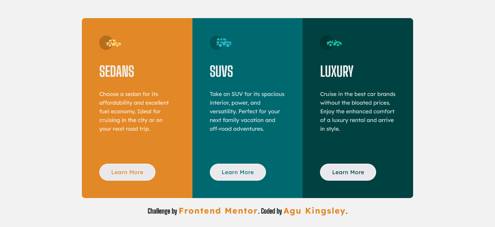
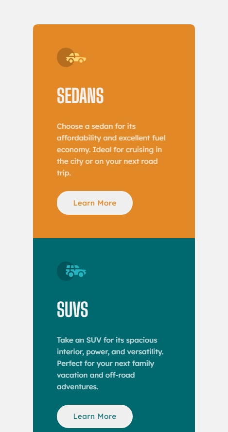

# Frontend Mentor - 3-column preview card component

## Table of contents

- [Overview](#overview)
  - [The challenge](#the-challenge)
  - [Screenshot](#screenshot)
  - [Links](#links)
- [My process](#my-process)
  - [Built with](#built-with)
  - [What I learned](#what-i-learned)
- [Author](#author)

## Overview

### The Challenge

Users should be able to:

- View the optimal layout depending on their device's screen size
- See hover states for interactive elements

### Screenshot

#### Desktop Design

#### Mobile Design

### Links

- Live Site URL: [3-Column Preview Card Component Site](https://three-column-card-component-kyng.netlify.app/)

## My Process

### Built with

- HTML
- CSS
- SCSS
- Flexbox
- Mobile-first workflow

### What I learned

##### CSS

- I learnt how to work with the **outline property** on the button and links to make it **accessible**.
- I learnt that **hover and focus states** should have the same styles.

##### SCSS

- I learnt how to work with the sass **@mixin directive** and call it with the **@include directive**
- I learnt Scss features **(nesting media queries)**

## Author

- Frontend Mentor - [@didyouseekyng](https://www.frontendmentor.io/profile/didyouseekyng)
- Twitter - [@didyouseekyng](https://www.twitter.com/didyouseekyng)
